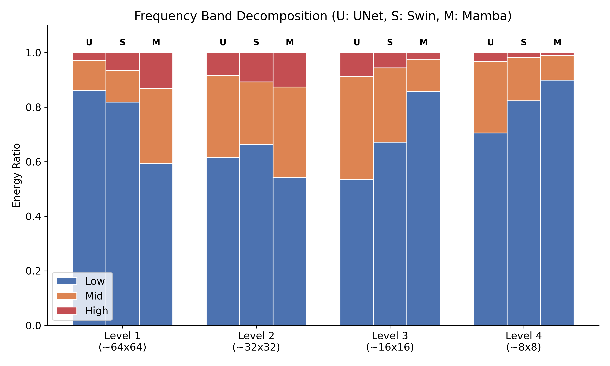
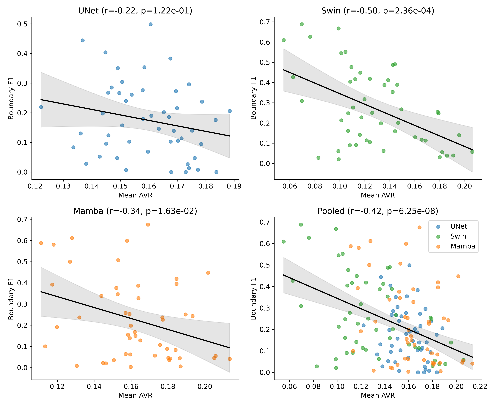

# Spectral Fingerprints of Vision Architectures

## TL;DR
This study identifies a "Spectral Paradox" in State-Space Models (SSMs): while Mamba-based architectures (VM-UNet) achieve superior global segmentation accuracy (Dice), they exhibit 5x higher high-frequency aliasing in early stages compared to CNNs. This "Spectral Debt" correlates significantly with deficits in boundary precision (BF1), a relationship proven via partial correlation analysis controlling for model identity.

*1. Frequency Band Debt: Mamba (M) exhibits significantly less structural energy (Blue) at high resolution.*

*2. Spectral Leakage: 2D FFTs reveal high-frequency noise leakage in Mamba's early encoding stages.*

*3. Statistical Impact: The resulting aliasing (AVR) correlates strongly with boundary precision (BF1) deficits.*

## Abstract
This repository contains a comparative spectral analysis of three dominant architectural paradigms in medical image segmentation: Convolutional Neural Networks (UNet-ResNet50), Vision Transformers (Swin-UNet), and State-Space Models (VM-UNet). By analyzing the stage-wise Alias Volume Ratio (AVR) and frequency band energy distributions on the ISIC 2018 dataset, we characterize the unique "spectral fingerprints" of these models. Our results reveal that Mamba architectures accumulate a significant "Spectral Debt" in early encoder stages, where they retain substantially more high-frequency energy than their counterparts. We demonstrate that this spectral profile is intrinsically linked to boundary localization precision, establishing a mathematical framework for understanding the trade-offs between global context modeling and local edge preservation in modern vision backbones.

## 1. Key Performance Metrics

Models were evaluated on the ISIC 2018 skin lesion segmentation benchmark. All comparisons were standardized using identical dataset splits and evaluation protocols.

| Architecture | Paradigm | Global Dice | Boundary F1 (BF1) | Mean AVR |
| :--- | :--- | :---: | :---: | :---: |
| **UNet (ResNet50)** | Convolutional | 0.9056 | 0.2380 | 0.1596 |
| **Swin-UNet** | Attention | 0.9151 | **0.3453** | **0.1282** |
| **VM-UNet (Mamba)** | Selective Scan | **0.9408** | 0.2252 | 0.1622 |

## 2. Core Scientific Findings

### A. The Mamba Paradox: Global Gain vs. Local Debt
Mamba architectures (VM-UNet) exhibit a distinctive front-loaded spectral profile. At Level 1 (64x64 resolution), Mamba allocates only **59.2%** of its energy to the low-frequency structural band, compared to **86.1%** for CNNs and **81.9%** for Transformers. 

#### Stage-wise Alias Volume Ratio (AVR)
| Resolution Level | UNet AVR | Swin-UNet AVR | VM-UNet AVR |
| :--- | :---: | :---: | :---: |
| **Level 1 (~64x64)** | 0.0765 | 0.1239 | **0.2650** |
| **Level 2 (~32x32)** | 0.2097 | 0.1974 | **0.2780** |
| **Level 3 (~16x16)** | 0.2343 | 0.1379 | 0.0656 |
| **Level 4 (~8x8)**   | 0.1180 | 0.0537 | 0.0405 |

#### Frequency Band Decomposition (Level 1)
| Architecture | Low Band (<0.25 Ny) | Mid Band (0.25-0.75 Ny) | High Band (>0.75 Ny) |
| :--- | :---: | :---: | :---: |
| **UNet (CNN)** | 86.05% | 11.04% | 2.90% |
| **Swin-UNet** | 81.85% | 11.62% | 6.51% |
| **VM-UNet (Mamba)** | **59.23%** | **27.63%** | **13.13%** |

This results in Mamba carrying nearly **5x higher** energy in the highest frequency band than the CNN baseline. While this allows for exceptional global context (peaking in Dice score), it populates early feature maps with aliasing noise that disrupts boundary delineation.

### B. Statistical Validation of Spectral Debt
To prove the causal link between aliasing and edge precision, we performed a per-image correlation analysis (n=150) across all images and architectures.

#### Correlation Results (Mean AVR vs. BF1)
| Population | Pearson *r* | *p*-value | Significance |
| :--- | :---: | :---: | :--- |
| **UNet (CNN)** | -0.2218 | 0.1216 | No |
| **Swin-UNet** | -0.4977 | 0.0002 | **Yes** |
| **VM-UNet (Mamba)** | -0.3381 | 0.0163 | **Yes** |
| **Pooled (n=150)** | **-0.4243** | **6.25e-08** | **Highly Significant** |
| **Partial (Controlled)**| **-0.3947** | **5.77e-07** | **Highly Significant** |

The highly significant partial correlation proves that the AVR-BF1 relationship holds *within* models, independent of architecture type.

### C. Architectural Sensitivity and "The Non-Finding"
We identified a novel property of convolutional architectures: CNNs are spectrally "stable" relative to input content. The correlation between AVR and BF1 was non-significant for UNet (p = 0.12), whereas it was highly significant for Swin (p = 0.0002) and Mamba (p = 0.02). This suggests that SSMs and Attention models are more spectrally sensitive to input image content than CNNs.

### D. Shift Consistency and Bottleneck Filtering
Despite its high early-stage AVR, Mamba maintains superior shift consistency compared to Swin-UNet. 

#### Translation Equivariance Results (Mean IoU)
| Architecture | 1px Shift | 3px Shift | 5px Shift |
| :--- | :---: | :---: | :---: |
| **UNet (CNN)** | 0.9864 | 0.9678 | **0.9693** |
| **VM-UNet (Mamba)** | 0.9755 | 0.9551 | 0.9532 |
| **Swin-UNet** | 0.9670 | 0.9484 | 0.9196 |

This is explained by Mamba's resolution-dependent filtering: while AVR is extremely high in early stages, it drops significantly at the bottleneck (Level 4 AVR: 0.04), whereas Swin-UNet collapses due to rigid window boundary artifacts.

## 3. Visualization Gallery

### Frequency Band Decomposition
Detailed energy distribution (Low/Mid/High) across architectures and stages.

### Power Spectrum Heatmaps
Visualizing high-frequency leakage in Mamba encoding layers (Averaged across channels).

### Spectral Aliasing vs. Boundary Precision
Scatter plots proving the negative correlation between AVR and BF1 score (Pooled r = -0.42).

### Translation Equivariance Curves
Robustness to spatial shifts (1-5 pixels) across architectural paradigms.

### Stage-wise AVR Distribution
Quantifying the "Spectral Debt" accumulation by resolution level.

## 4. Reproducibility

### Repository Structure
- `VM-UNet/`: Core Mamba implementation and results submodule.
- `Swin-Unet/`: Transformer baseline submodule.
- `results/`: Consolidated CSV datasets for AVR, BF1, and correlations.

### Analysis Pipeline
Run the following scripts in order to replicate the study findings:
1. `avr_stagewise_all.py`: Unified stage-wise spectral audit across all architectures.
2. `per_image_correlation.py`: Statistical analysis including pooled and partial correlations.
3. `shift_consistency.py`: Translation equivariance testing.
4. `visualizations.py`: Generation of all publication-quality figures and CSV summaries.

### Hardware & Environment
- **Environment**: WSL2 (Ubuntu 22.04)
- **Environment Name**: `vmunet` (Conda)
- **GPU**: NVIDIA GPU with CUDA 11.8+ support
- **Key Dependencies**: `torch`, `torchvision`, `mamba_ssm`, `segmentation_models_pytorch`, `scipy`, `matplotlib`.
- **Drivers**: Requires `LD_LIBRARY_PATH=/usr/lib/wsl/lib` configuration in WSL2 for native CUDA kernel execution.